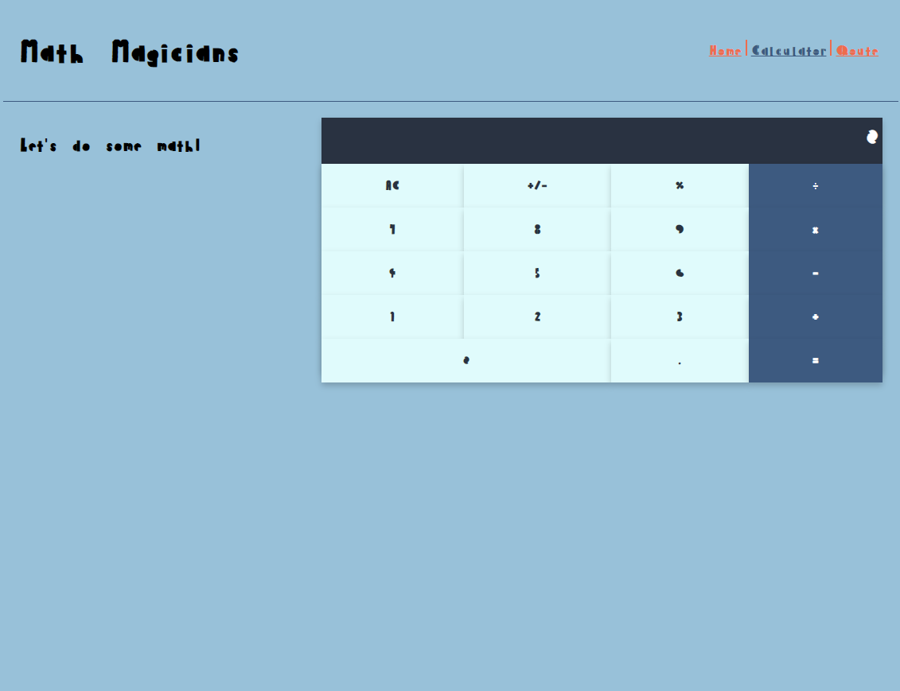

# Math-Magician

> It's Maths and Magic.


"Math magicians" is a website for all fans of mathematics. It is a Single Page App (SPA) that allows users to:
- Make simple calculations. 
- Read a random math-related quote.
## Screenshots Desktop 📷



## Built With

- React

## Live Demo

Coming soon...

## Getting Started

To get a local copy up and running follow these simple example steps.

### Prerequisites

A Web Browser (preferably Google Chrome)

### Setup

- Clone the GitHub Repository
- Go to the Project Directory
- Run ```npm install```
- Run ```npm run build``` to build the project

### Usage

- Run ```npm run start``` to start the live server


👤 **Author**

- GitHub: [@Bavon101](https://github.com/Bavon101)
- LinkedIn: [LinkedIn](https://www.linkedin.com/in/akumu-bavon-335416193/)

## 🤝 Contributing

Contributions, issues, and feature requests are welcome!

Feel free to check the [issues page](../../issues/).

## Show your support

Give a ⭐️ if you like this project!

## Acknowledgments

- Microverse

## 📝 License

This project is [MIT](./LICENSE) licensed.